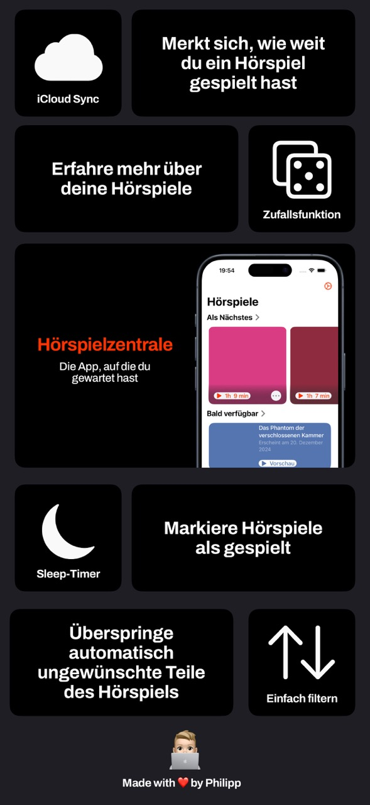
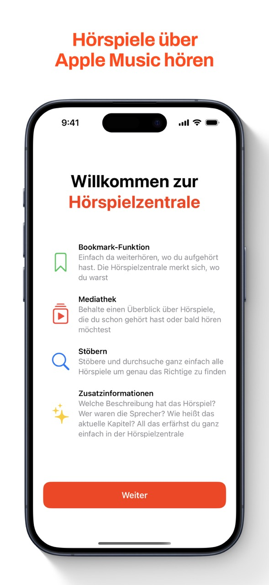
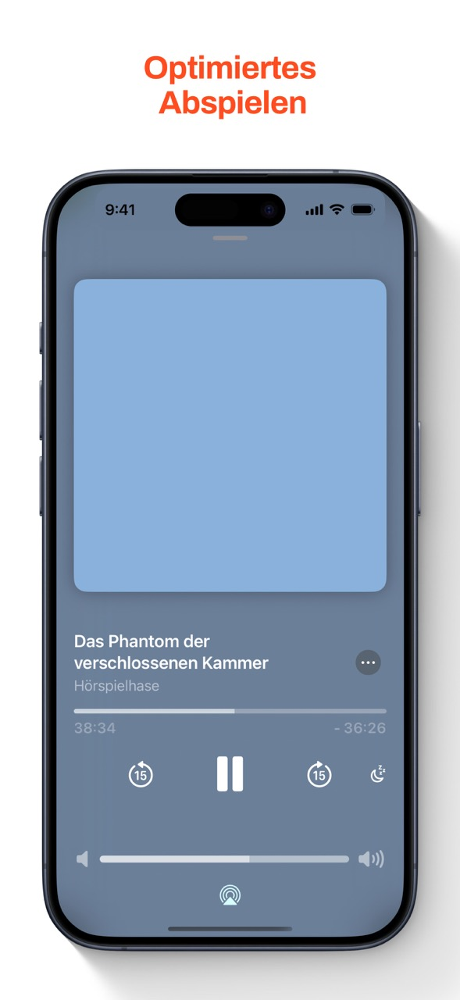
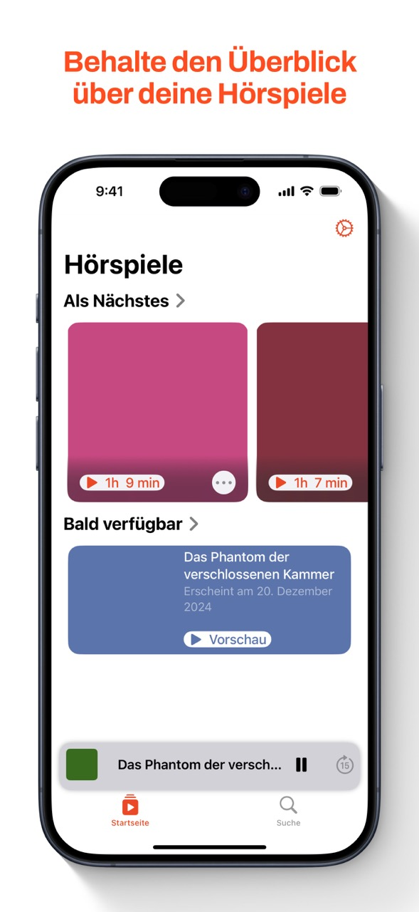
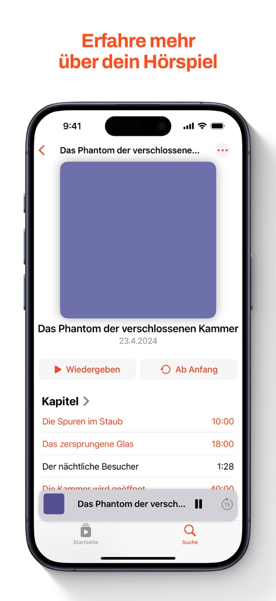
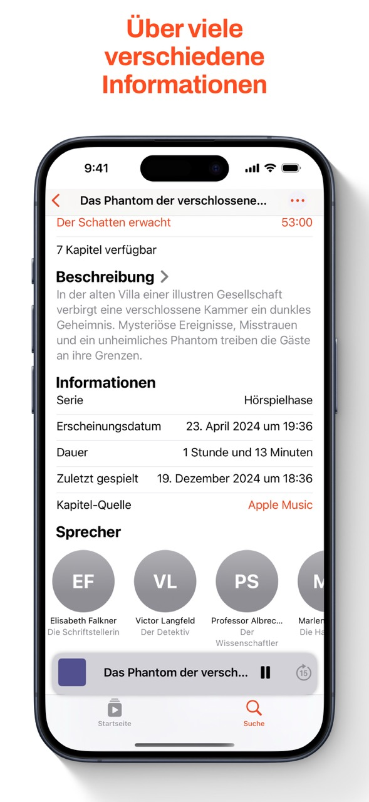
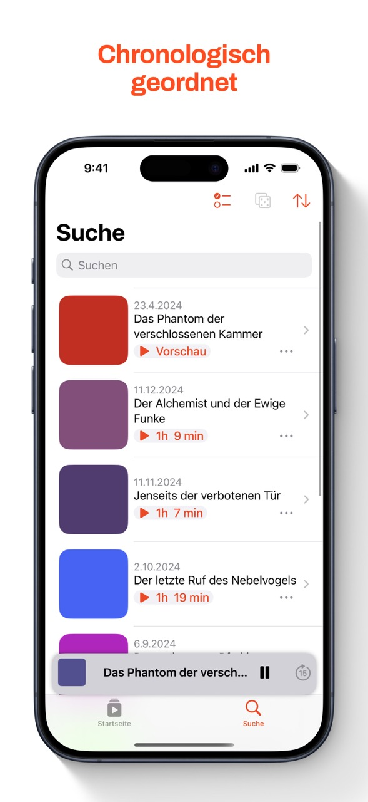

# Hörspielzentrale
Hörspielplayer für Apple Music

## Beschreibung der App
Die Hörspielzentrale vereinfacht das Abspielen von Hörspielen über Apple Music und kann weitere Informationen wie Kapitel, Sprecher und Beschreibungen anzeigen. 

  
   
  
  
   
  
  

## Installation
### Installation der App über den App Store

### Installation des Codes über Xcode
Drücke auf "Code" und wähle "Open with Xcode". Wähle einen Speicherort und drücke auf "Clone". Wenn gefragt, drücke auf "Trust and Open". 
Eventuell scheitert der Build an fehlenden Packages, obwohl diese in der Seitenleiste zu sehen sind. In dem Fall entferne ein Package und füge es erneut hinzu.
Zudem fehlt die Datei Secrets.xcconfig. Wähle als neue Datei "Configuration Settings File" und nenne diese "Secrets.xcconfig" Die Datei sollte nicht Teil eines Unterordners sein.

> **_WICHTIG:_** Um die Hörspiele abspielen zu können, muss der MusicKit App Service aktiviert sein. Siehe dazu [MusicKit Dokumentation](https://developer.apple.com/documentation/musickit/using-automatic-token-generation-for-apple-music-api)

## Contributing
Pull-Requests und Issues sind sehr willkommen. 

## License
Dieses Repo ist aktuell nicht mit einer Lizenz versehen. Ich behalte mir alle Rechte vor. Private Nutzung des Codes ist erlaubt, alles weitere muss vorher mit mir abgesprochen werden. Schreibe mir dazu eine Email an hoerspielzentrale@icloud.com
